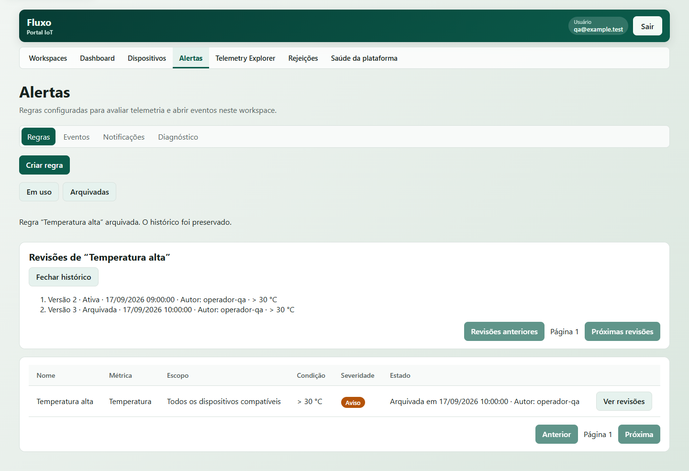

# Fluxo

[](https://github.com/hard87/fluxo-iot-platform/actions/workflows/ci.yml)

Plataforma IoT para cadastro, provisionamento e monitoramento de dispositivos conectados.

> **English summary:** Fluxo is an IoT platform to provision devices and ingest, store and visualize their telemetry.
> Stack: ASP.NET Core (Clean Architecture), PostgreSQL, Mosquitto (MQTT over TLS), React + TypeScript.
> Status: working MVP (API, ingestion worker, web portal); alerting and a physical pilot with a Raspberry Pi gateway are in progress.
> This is a portfolio project. To run it locally, see [Início rápido](#início-rápido-local).
> License: all rights reserved. The source is public for portfolio review; there is no license to use, copy or distribute it yet.



Este repositório foi estruturado como portfólio técnico, com foco em:
- arquitetura limpa para backend .NET;
- pipeline de ingestão MQTT com rastreabilidade;
- segurança aplicada ao MVP;
- operação local reprodutível via Docker.

## Estado atual

- MVP funcional com API, Worker e Portal Web.
- Suporte a autenticação de usuário no portal e isolamento por workspace.
- Provisionamento de device com credencial MQTT e tópico dedicado.
- Ingestão de telemetria com trilha de rejeição e idempotência por sequence.
- Telemetry Query API e Telemetry Explorer no portal.
- Alertas com regras, eventos e notificações no portal (canal de e-mail ainda pendente).
- Piloto físico com gateway Raspberry Pi em andamento.
- Guia de piloto controlado e roadmap para escala.

O detalhe fase a fase está em [Estado atual do projeto](docs/project-status.md).

## Arquitetura em alto nível

- Backend: ASP.NET Core + Clean Architecture
- Banco: PostgreSQL
- Broker: Mosquitto (MQTT)
- Ingestão: Worker .NET consumindo MQTT
- Frontend: React + Vite + TypeScript

Fluxo de dados (resumo):

```text
Device -> MQTT Broker (Mosquitto) -> Worker Ingestion -> PostgreSQL
                                        |
                                        v
                                   Telemetry Rejections

Portal Web -> API -> PostgreSQL
```

Camadas do backend:

```text
src/
  Fluxo.Api            # Transporte HTTP, middleware, configuração
  Fluxo.Application    # Use cases, regras de aplicação, DTOs
  Fluxo.Domain         # Entidades e regras de domínio
  Fluxo.Infrastructure # EF Core, repositórios, migrations
  Fluxo.Worker.Ingestion
```

## Decisões de arquitetura

As decisões que moldaram o projeto estão registradas como ADRs:

- [ADR-0001](docs/adr/0001-telemetry-schema-v2.md): contrato de telemetria V2 e schema chave-valor tipado.
- [ADR-0002](docs/adr/0002-alert-evaluation-state-and-delivery.md): motor de alertas com estado persistido e entrega desacoplada.
- [ADR-0003](docs/adr/0003-telemetry-query-api.md): Telemetry Query API.
- [ADR-0004](docs/adr/0004-pi-gateway-store-and-forward.md): gateway Raspberry Pi com store-and-forward persistente.
- [ADR-0005](docs/adr/0005-alertas-canais-historico-isolamento-proposta.md): canais, histórico e isolamento de alertas (proposta).

## Como uso IA neste projeto

Uso ferramentas de IA (Claude e Codex) como apoio de implementação, revisão e documentação. As decisões de escopo e de arquitetura são minhas e ficam registradas nos ADRs. Hoje a `main` é protegida: todo trabalho entra por PR, com CI e testes obrigatórios. Os relatórios em [docs/handoff](docs/handoff) mostram como esse processo funciona na prática.

## Como navegar neste portfólio

Se você tem 5 minutos:
1. Leia este README.
2. Abra o [índice de documentação](docs/README.md).
3. Veja [Piloto real controlado](docs/piloto-real-controlado.md) e [Roadmap 1000 devices](docs/roadmap-production-1000-devices.md).

Se você tem 15 minutos:
1. Suba o ambiente local.
2. Rode os testes.
3. Execute o fluxo de provisionamento + ingestão MQTT.

## Início rápido (local)

1. Copie variáveis:

```powershell
Copy-Item .env.example .env
```

2. (Opcional, recomendado) Gere certificados TLS locais para MQTT:

```powershell
powershell -ExecutionPolicy Bypass -File docker/mosquitto/scripts/generate-local-certs.ps1 -CommonName broker.fluxo.local
```

3. Suba stack Docker:

```powershell
docker compose build
docker compose up -d
```

Autenticação e ACL por device no Mosquitto são provisionadas automaticamente pela API
(plugin `dynamic-security`, sem passo manual). Veja
[MQTT TLS e credenciais por device](docs/mqtt-tls-e-credenciais.md).

Para o perfil de produção controlada mínima, use:

```powershell
docker compose -f docker-compose.controlled-prod.yml build
docker compose -f docker-compose.controlled-prod.yml up -d
```

4. Aplique migration:

```powershell
dotnet ef database update `
  --project src/Fluxo.Infrastructure/Fluxo.Infrastructure.csproj `
  --startup-project src/Fluxo.Api/Fluxo.Api.csproj
```

Referências detalhadas:
- [Deploy local seguro](docs/deploy-local-seguro.md)
- [Piloto real controlado](docs/piloto-real-controlado.md)

## Endpoints locais

- API: `http://localhost:5000`
- Health API: `http://localhost:5000/health`
- Status API: `http://localhost:5000/api/status`
- Portal web: `http://localhost:8080`
- MQTT dev interno em loopback: `localhost:1883`
- MQTT TLS local: `localhost:8883`

## Qualidade e testes

```powershell
dotnet build Fluxo.slnx
dotnet test Fluxo.slnx
```

Frontend (local sem Docker):

```powershell
cd portal-web
npm install
npm run dev
```

## Documentação

Veja o índice central em [docs/README.md](docs/README.md).

## Segurança

- Não versione `.env`, credenciais MQTT, chaves privadas ou segredos locais.
- Não versione runtime do broker (`docker/mosquitto/data/`, `docker/mosquitto/log/`) nem backups reais.
- Configure `FLUXO_AUTH_SIGNING_KEY` com valor forte (>= 32 chars) antes de subir a API.
- Em produção controlada, use `docker-compose.controlled-prod.yml`, não publique `1883` e use TLS MQTT em `8883`.
- Referência técnica: [Segurança OWASP](docs/seguranca-owasp.md).

## Roadmap

- [Roadmap técnico para produção com 1000 dispositivos](docs/roadmap-production-1000-devices.md)

## Licença

Copyright © 2026 Junior Godoi. Todos os direitos reservados.

O código está público para leitura e avaliação como portfólio técnico, mas ainda não há licença que autorize uso, cópia, modificação ou distribuição. O Fluxo segue em evolução e o modelo de licenciamento será definido mais adiante. Se tiver interesse em usar o projeto, fale comigo pelo [LinkedIn](https://linkedin.com/in/juniorgodoi87) ou pelo [site da Officina 404](https://officina404.com.br).

## Contribuição

Fluxo de contribuição e padrão de PR em [CONTRIBUTING.md](CONTRIBUTING.md).
